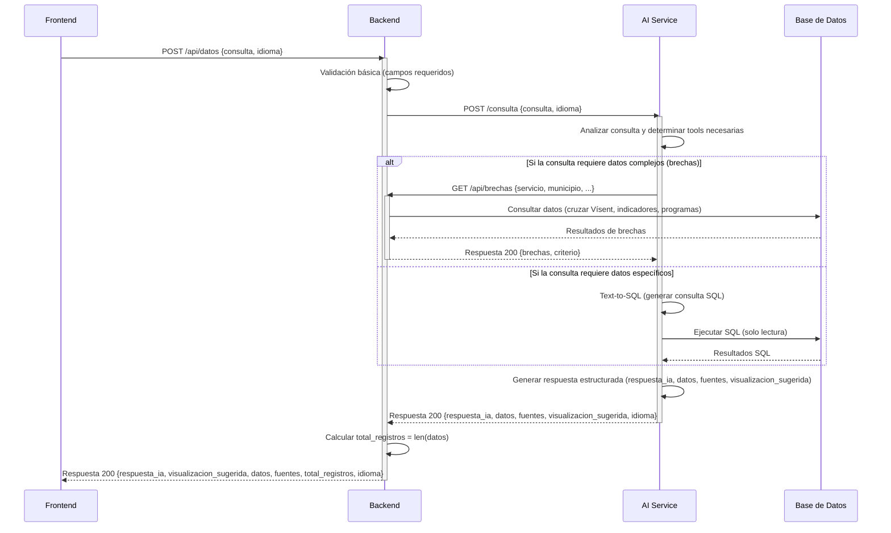
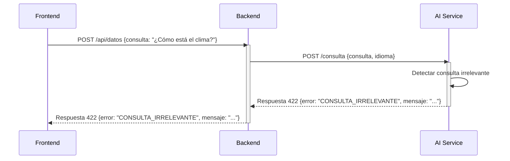
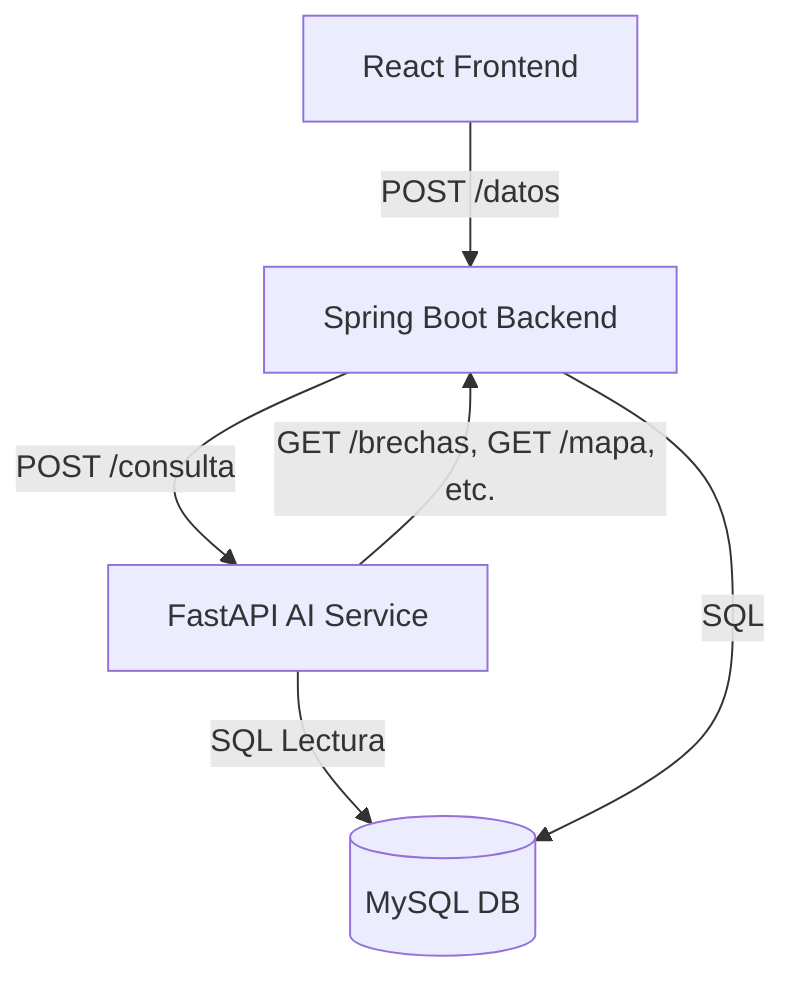

# Arquitectura de Integración de IA

## 1. Resumen de la Arquitectura

Esta arquitectura describe la integración end-to-end del servicio de IA con el resto del sistema, desde la solicitud del frontend hasta la respuesta final.

### Componentes Principales

| Componente       | Tecnología       | Responsabilidad Principal                                                                 |
|------------------|------------------|-------------------------------------------------------------------------------------------|
| **Frontend**     | React            | Interfaz de usuario, envía consultas en lenguaje natural y visualiza resultados           |
| **Backend**      | Spring Boot      | Proxy seguro, validación básica, orquestación de flujos y acceso a DB                     |
| **AI Service**   | FastAPI + LangChain / LlamaIndex | Text-to-SQL, razonamiento, orquestación de tools (tool calling)                          |
| **Base de Datos**| MySQL            | Almacenamiento de datos de Vísent, indicadores territoriales y programas sociales          |
| **Docker**       | Docker Compose   | Orquestación de contenedores para entorno de desarrollo/producción                         |

---

## 2. Principio Clave de la Integración

**Regla de Prioridad para Obtener Datos:**
1. **Primero**: Usar endpoints existentes del backend (como `/brechas`, `/mapa`, `/programas`)
2. **Solo si no hay alternativa**: Usar Text-to-SQL para consultas sencillas

---

## 3. Flujo Principal (POST /datos)

El flujo principal es para el uso del frontend, donde el usuario envía una consulta en lenguaje natural.

### Detalles Paso a Paso

1. **Solicitud Frontend -> Backend**
   - El frontend envía una consulta en lenguaje natural y el idioma deseado
   - Endpoint: `POST /api/datos`
   - El backend valida que los campos `consulta` estén presentes

2. **Proxy Backend -> AI Service**
   - El backend actúa como puente seguro:
     - Autenticación/autorización (si es necesario en el futuro)
     - Rate limiting
     - Logging
     - Transformación de formato de datos si es necesario
   - Endpoint AI Service: `POST /consulta`

3. **Razonamiento AI Service (Sigue la Regla de Prioridad)**
   - El AI Service analiza la consulta y decide la mejor fuente de datos:
     a. **Primero**: ¿Hay un endpoint del backend que ya devuelve estos datos? (ej: `/brechas`, `/mapa`, `/programas`)
     b. **Solo si no**: Usar Text-to-SQL para consultas sencillas

4. **Obtención de Datos**
   - **Opción 1 (Endpoints del Backend - Prioridad Alta):**
     - El AI Service llama al endpoint correspondiente del backend
     - El backend consulta la DB y devuelve datos estructurados
   - **Opción 2 (Text-to-SQL):**
     - El AI Service genera SQL y lo ejecuta directamente contra la DB (solo permisos de lectura)
     - **Solo para consultas sencillas** que no tienen endpoint en el backend

5. **Generación de Respuesta AI Service**
   - El AI Service genera una respuesta estructurada con:
     - `respuesta_ia`: Explicación en lenguaje natural
     - `datos`: Datos crudos para visualizar
     - `fuentes`: Orígenes de los datos
     - `visualizacion_sugerida`: Tipo de gráfico/mapa recomendado
     - `idioma`: Idioma de la respuesta

6. **Respuesta Backend -> Frontend**
   - El backend calcula `total_registros` (tamaño de la lista `datos`)
   - El backend devuelve la respuesta final al frontend

---

## 4. Flujo de Error (Consulta Irrelevante)

Si la consulta no puede resolverse con los datos disponibles:

---

## 5. Consideraciones Clave y Alternativas

### 5.1 ¿Por qué priorizar endpoints del backend sobre Text-to-SQL?

1. **Control de acceso a datos**: Todo el acceso a la DB está centralizado en el backend
2. **Mantenibilidad**: La lógica de consulta compleja está en un solo lugar
3. **Seguridad**: El AI Service no necesita acceso directo a la DB para consultas comunes
4. **Rendimiento**: Los endpoints del backend ya estarán optimizados y testeados

### 5.2 ¿Cuándo usar Text-to-SQL?

Solo cuando:
- La consulta es **sencilla**
- No existe un endpoint en el backend que devuelva esos datos
- Es una consulta de lectura única (SELECT)

**Importante:**
- El AI Service **solo debe tener permisos de lectura** en la DB
- Las consultas deben estar limitadas en tiempo (timeout) para evitar cargas excesivas

## 6. Diagrama de Arquitectura General

---

## 7. Seguridad

- **Autenticación:** En producción, el backend y el AI Service deben autenticarse entre sí (ej: API keys, OAuth2)
- **Permisos DB:** El usuario de DB para el AI Service solo debe tener permisos de SELECT
- **Rate Limiting:** El backend debe limitar la cantidad de consultas por usuario para evitar abusos
- **Sanitización:** El AI Service debe validar y sanitizar cualquier SQL generado para evitar inyecciones

---

## 8. Logging y Monitoreo

- **Backend:** Loguear todas las solicitudes y respuestas del endpoint /datos
- **AI Service:** Loguear:
  - Consultas recibidas
  - Tools utilizadas
  - SQL generado (solo si se usa)
  - Tiempo de respuesta
- **Monitoreo:** Alertas por tiempos de respuesta lentos o errores frecuentes

---

## 9. Resumen de Contratos Relacionados

Para más detalles:
- [API_CONTRATOS.md](./API_CONTRATOS.md): Contratos entre frontend y backend
- [AI_CONTRATOS.md](./AI_CONTRATOS.md): Contratos entre backend y AI Service
